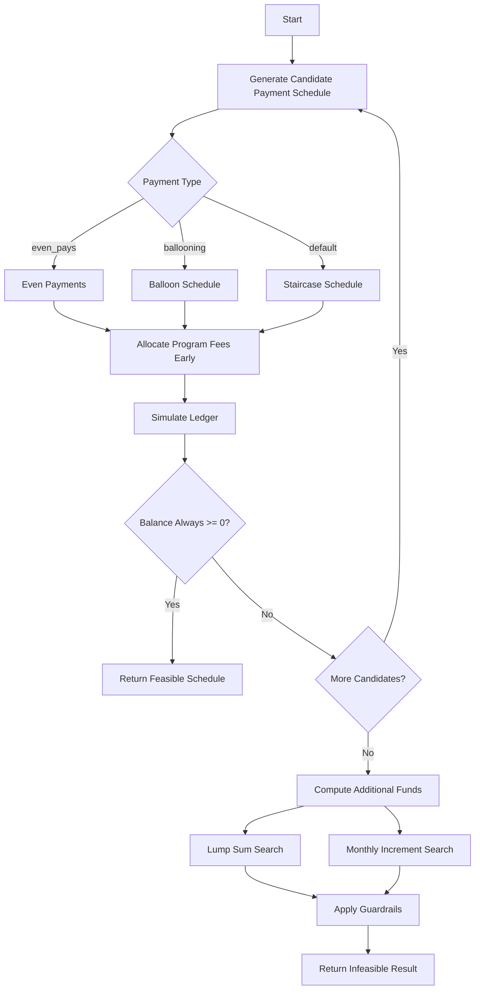

# Settlement Feasibility & Fee Engine — Take-home

Welcome, and thanks for taking the time. The full problem is in
[`ASSIGNMENT.md`](./ASSIGNMENT.md). This README is just orientation.

## The task in one line

Given a client's escrow account, a settlement offer, and a creditor's rules,
decide whether the offer is affordable (and schedule it, collecting our fee as
early as allowed) or — if not — compute the minimum extra funding needed.

## Setup

```bash
python3 -m venv venv && source venv/bin/activate
pip install -r requirements.txt
```

## Layout

```
hiring_takehome/
├── ASSIGNMENT.md            # full specification — read this
├── feasibility/
│   ├── models.py            # data models, JSON loaders, date/EOM helpers (provided)
│   └── engine.py            # >>> implement evaluate_offer here <<< (+ Result shape)
├── cases/                   # example cases (client.json / offer.json / creditor_rules.json)
│   ├── case1_feasible_even
│   ├── case2_infeasible_minima
│   ├── case3_balloon
│   ├── case4_tiers
│   ├── case5_token_pays      # staircase + max_token_pays cap
│   ├── case6_max_segments    # staircase + max_segments cap
│   └── case7_guardrail_exceed # infeasible; Part 2 guardrails fail
├── tests/
│   ├── test_smoke.py        # scaffolding sanity tests (pass out of the box)
│   ├── test_cases.py        # example expectations for cases 1–4
│   ├── test_additional_cases.py  # expectations for cases 5–7
│   └── test_edge_cases.py   # unit-level edge cases
├── run.py                   # python run.py cases/<case>
└── requirements.txt
```

## Run

```bash
# evaluate a single case (prints the Result as JSON)
python run.py cases/case1_feasible_even

# tests
pytest -q
```

Out of the box, `tests/test_smoke.py` passes and `tests/test_cases.py` fails —
the latter is your target. Go beyond those four cases with your own tests.

## What to submit

Your implementation, your tests, and a short README section describing:
- your approach and the alternatives you considered,
- **your interpretation of the payment shapes** (even / staircase / balloon — we
  left these loosely defined on purpose),
- assumptions you made, and known edge cases / limitations.

Budget ~5–6 hours. Prefer a correct, well-tested core over breadth. When in
doubt, write down your assumption and keep going.


---

## Implementation notes

### Approach

The engine splits into four layers:

1. **Payment shapes** (`payments/`) — build creditor payment vectors (even, staircase, balloon) that sum exactly to `offer_total` and respect per-position floors.
2. **Floors** (`payments/floors.py`) — token pays (exactly at `min_payment_cents`, capped by `max_token_pays`) and tier step-ups from `min_payment_tiers`.
3. **Scheduling** (`scheduling/`) — greedily front-load program fees on cadence dates, then simulate the ledger day-by-day (credits before debits, horizon enforced).
4. **Solver** (`feasibility/solver.py`) — try payment counts `k` within `min(max_terms, max_payments)`; for even/staircase pick the schedule that collects fees earliest; for balloon take the first feasible schedule with the fewest early payments.

When no schedule works, **Part 2** (`funding/additional_funds.py`) binary-searches minimum lump sum (placed on the earliest useful date) and minimum uniform draft increment separately, then applies guardrails.

**Alternatives considered:** (a) dynamic programming on ledger state — rejected due to date/credit complexity; (b) current enumerate-`k` + greedy fee placement — chosen for clarity and testability.

### Payment shape interpretation

| Shape | When used | Definition |
|-------|-----------|------------|
| **Even** | `even_pays = true` | All `k` payments as equal as possible; remainder (+1 cent) on the **latest** payments. |
| **Balloon** | `is_ballooning_allowed = true` (and not even) | Positions `1..k-1` at floor; final payment absorbs remainder. Search `k` from largest downward; first feasible wins (maximizes deferral). |
| **Staircase** | neither flag set | Start each position at its floor; push all excess onto the **last** payment; then collapse to ≤ `max_segments` distinct levels by grouping positions and enforcing non-decreasing segment values. |

**Token pays / tiers + balloon:** Floors are computed per position before shape construction. Token-cap enforcement adds +1 cent to the base minimum once `max_token_pays` token slots are used. For balloon, early pays sit at floor; the final balloon must still meet the last position's floor (including tier bumps).

**Fee-only months:** Cadence continues through the horizon after the last creditor payment; those dates carry program fee only (no bank fee, no creditor pay).

### Assumptions

- `first_payment_date` omitted → end of month of `first_draft_date` (provided helper).
- Part 2 lump sum is merged into an existing ledger credit on the chosen date, or added as a new credit.
- Monthly increment applies uniformly to every future draft credit after `as_of_date`.
- When both even and balloon flags were set, `even_pays` takes precedence (not seen in provided cases).

### Known limitations / edge cases

- Staircase segment placement uses fixed-size grouping rather than exhaustive segment search; works for provided cases but may not find every theoretically valid staircase under tight `max_segments`.
- Part 2 binary search upper bound is fixed at 10M cents; sufficient for take-home inputs.

### Additional test cases

| Case | What it exercises |
|------|-------------------|
| `case5_token_pays` | Staircase shape with `max_token_pays = 3` — at most three payments at the base minimum |
| `case6_max_segments` | Staircase shape with `max_segments = 2` — at most two distinct payment levels |
| `case7_guardrail_exceed` | Infeasible offer where both lump sum and monthly increment exceed guardrails |



